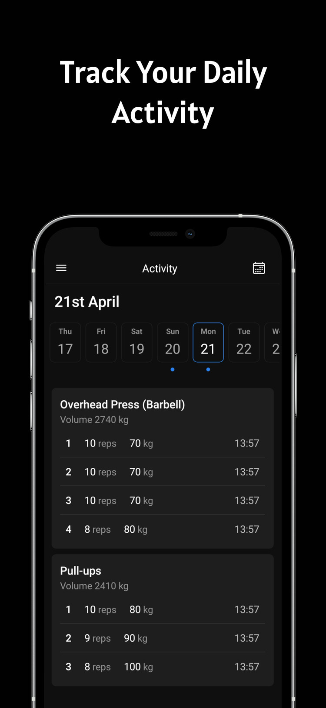
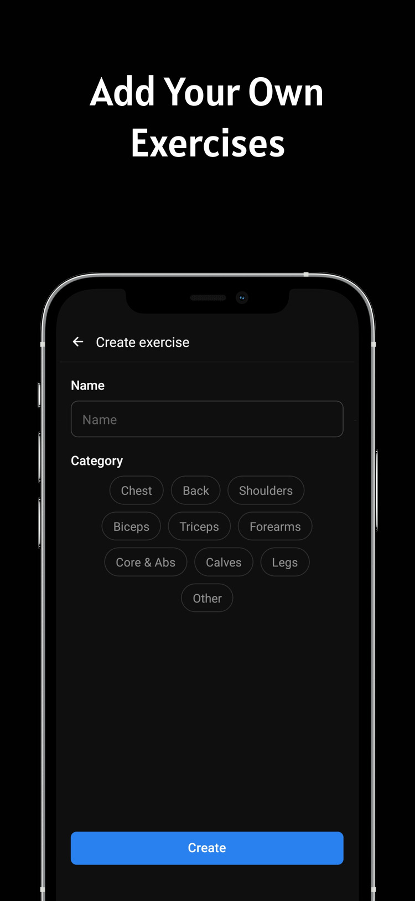
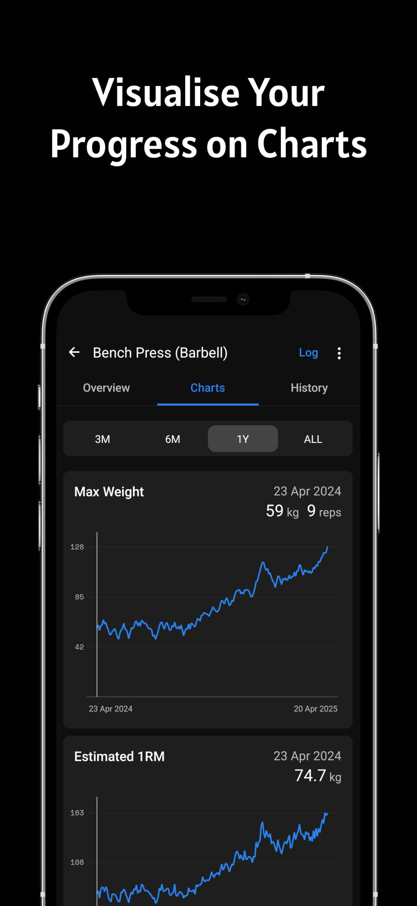
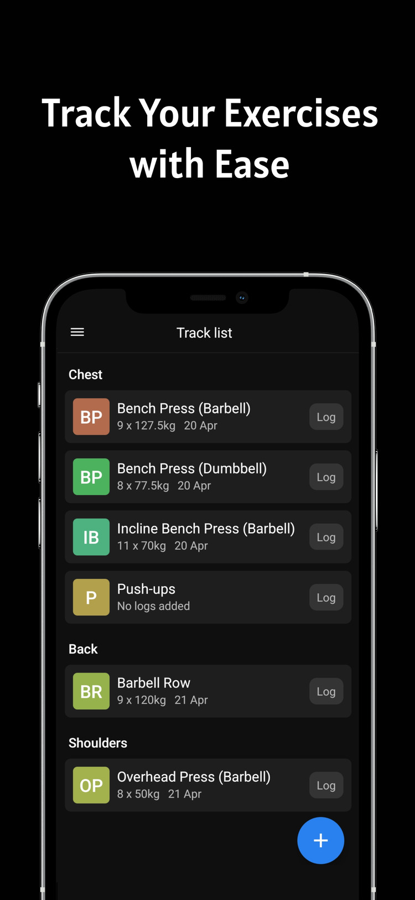
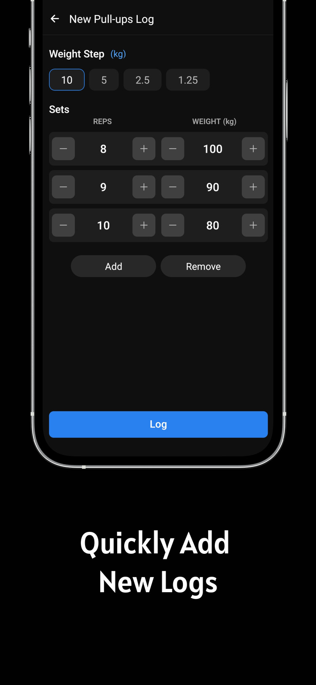
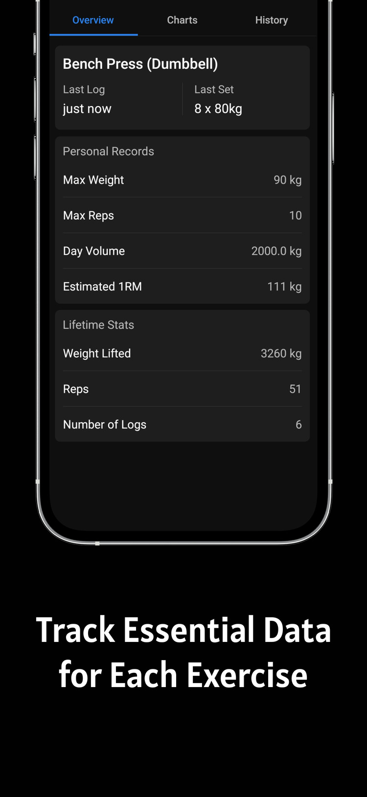

# Just Log
**Just Log** is a simple and clean fitness tracking app built to help users log their workouts, visualize progress, and stay consistent. It was developed as a learning project using React Native.

## Features
📈 Interactive Charts – Visualize your workout stats and progress over time 
🗓️ Workout Logging – Easily log exercises, sets, reps, and weights 
📚 Workout History – Review past workouts and track long-term trends 
🔄 Daily Activity Overview – Stay motivated with daily summaries of your logged workouts 
🧼 Minimal UI – Simple, user-friendly design focused on functionality
 
## Screenshots

  
  
  

  
  
  

